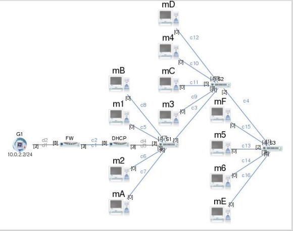

Projet GNS3 – Architecture Réseau Sécurisée

Ce projet consiste à concevoir, configurer et valider une architecture réseau complète et sécurisée sous GNS3, intégrant plusieurs réseaux, un service DHCP, un firewall, du routage dynamique et une connectivité Internet fonctionnelle.

**Sommaire**

Topologie Réseau

Objectifs du Projet

Fonctionnalités Implantées

Configuration des Équipements

Prérequis

Installation & Déploiement

Tests de Validation

Outils Utilisés

Structure du Répertoire

Équipe Projet

**Topologie Réseau**

**Objectifs du Projet**

Mettre en place une architecture réseau multi-segment avec 2 réseaux distincts.

Assurer une distribution d’adresses via DHCP.

Déployer un firewall assurant la sécurité et le filtrage du trafic.

Fournir un accès Internet complet à toutes les machines.

Implémenter un NAT fonctionnel, un routage propre et une segmentation correcte.

Vérifier la communication inter-réseaux et les performances.

**Fonctionnalités Implantées**

Deux réseaux composés de 6 machines chacun

Service DHCP opérationnel (Cisco Router)

3 switchs assurant la segmentation et la répartition du trafic

Firewall entre LAN et WAN

Accès Internet via VMware NAT

NAT + routage configurés

Tests de connectivité concluants

**Configuration des Équipements**

_**Routeur DHCP**_

Pool DHCP : 192.168.10.0/24

Route par défaut vers le firewall :

ip route 0.0.0.0 0.0.0.0 10.10.0.2

Exclusions d’adresses configurées

_**Firewall**_

NAT Overload pour la sortie Internet

Routes statiques pour retour vers les réseaux internes

_**VMware**_

Fournit la connectivité Internet via la carte vmnet8

Relié au firewall dans GNS3

**Prérequis**

GNS3 installé

Image Cisco c3725

VMware Workstation

Fichier du projet : SAE-R502-2.gns3project

**Installation & Déploiement**

Importer le projet dans GNS3 :

Ouvrir GNS3

File → Import Portable Project

Sélectionner SAE-R502-2

Démarrer les équipements :

Routeurs

Switchs

Firewall

Machines virtuelles

Obtenir une IP via DHCP :

Les VMs reçoivent une adresse via DHCP

Tests de Validation

Ping entre machines du même réseau

Ping inter-réseaux

Ping vers l’extérieur (8.8.8.8)

Accès Internet depuis toutes les machines

DHCP fonctionnel et stable

NAT opérationnel sur le firewall

Exemple de validation :

ping 8.8.8.8

**Outils Utilisés**

GNS3 : Simulation réseau

GitHub : Versionning du projet

Trello : Suivi de l'avancée du projet

VMware : Accès Internet et virtualisation

**Structure du Répertoire**

/SAE-R502-Piloter

├── SAE-R502-2.gns3                 # Projet GNS3 principal

├── projet_files/                   # Configurations routeurs/firewall

**Équipe Projet**

Lead Dev  : AMARATUNGA Shanaka, DOUMA Lucas

Scrum Master : BEN MOUALLI Ayoub

**Licence**

MIT License

Copyright (c) 2025 AMARATUNGA Shanaka

Permission is hereby granted, free of charge, to any person obtaining a copy
of this software and associated documentation files (the "Software"), to deal
in the Software without restriction, including without limitation the rights
to use, copy, modify, merge, publish, distribute, sublicense, and/or sell
copies of the Software, and to permit persons to whom the Software is
furnished to do so, subject to the following conditions:

The above copyright notice and this permission notice shall be included in all
copies or substantial portions of the Software.

THE SOFTWARE IS PROVIDED "AS IS", WITHOUT WARRANTY OF ANY KIND, EXPRESS OR
IMPLIED, INCLUDING BUT NOT LIMITED TO THE WARRANTIES OF MERCHANTABILITY,
FITNESS FOR A PARTICULAR PURPOSE AND NONINFRINGEMENT. IN NO EVENT SHALL THE
AUTHORS OR COPYRIGHT HOLDERS BE LIABLE FOR ANY CLAIM, DAMAGES OR OTHER
LIABILITY, WHETHER IN AN ACTION OF CONTRACT, TORT OR OTHERWISE, ARISING FROM,
OUT OF OR IN CONNECTION WITH THE SOFTWARE OR THE USE OR OTHER DEALINGS IN THE
SOFTWARE.
